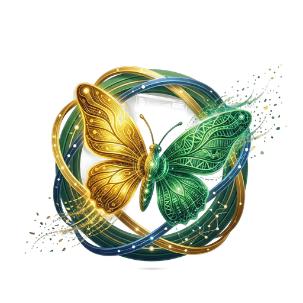

<p align="center">
  
</p>

<h1 align="center">Pronote NG — Cartes</h1>

<p align="center">
  <strong>Dix cartes Lovelace pour l'intégration Home Assistant Pronote NG.</strong>
</p>

<p align="center">
  <a href="https://fiveelements.github.io/ha-pronote-ng-cards/">Documentation</a>
  ·
  <a href="https://fiveelements.github.io/ha-pronote-ng-cards/installation/">Installation</a>
  ·
  <a href="https://fiveelements.github.io/ha-pronote-ng-cards/tableaux-de-bord/">Assembler un tableau de bord</a>
  ·
  <a href="https://fiveelements.github.io/ha-pronote-ng-cards/limites/">Ce qu'elles ne feront jamais</a>
</p>

<p align="center">
  <a href="https://github.com/FiveElements/ha-pronote-ng-cards/actions/workflows/validate.yml"></a>
  <a href="https://github.com/FiveElements/ha-pronote-ng-cards/actions/workflows/hacs.yml"></a>
  <a href="https://github.com/FiveElements/ha-pronote-ng-cards/actions/workflows/docs.yml"></a>
  <a href="https://github.com/FiveElements/ha-pronote-ng-cards/releases"></a>
  
  <a href="LICENSE"></a>
</p>


*Illustration synthétique — aucune donnée réelle n'entre dans ce dépôt.*

## Ce qui distingue ces cartes

**Un seul réglage : l'appareil de l'enfant.** Aucune carte ne demande
d'identifiant d'entité, pas même celle du limiteur, qui remonte toute seule
jusqu'à l'appareil du compte. Chaque carte retrouve ses entités par une clé
technique stable, ce qui les rend insensibles à un renommage : renommer
l'enfant renomme la carte, sans rien casser.

**Trois états, jamais deux.** Une entité peut être absente du registre, ou
présente sans donnée exploitable, ou renseignée. Ces trois situations disent
des choses différentes à un parent, et aucune carte ne les confond : « entité
introuvable », « pas encore collectée » et le contenu réel sont trois
affichages distincts. Un cadre vide qui pourrait vouloir dire trois choses ne
vaut rien.

**Une carte n'appelle jamais PRONOTE.** Le type interdit à une carte tout appel
de service sauf deux — relever une priorité de collecte, cocher un devoir. Un
tableau de bord qu'on ouvre ne consomme donc aucune requête sur le compte
scolaire, quel que soit le nombre de cartes affichées. Le bouton de la carte
limiteur lui-même ne fait que demander à l'ordonnanceur de passer plus tôt : il
n'obtient aucune dérogation.

**Ce qui n'est pas su n'est pas affiché.** Une heure de fin déduite plutôt que
fournie porte un `≈`. Un libellé de maîtrise reste dans les mots de
l'établissement, jamais traduit. Une moyenne générale s'affiche sans barème,
parce que celui qui est publié n'en est pas un. La liste de ce qui est
volontairement absent est publiée :
[Ce que ces cartes ne feront jamais](docs/limites.md).

## Les dix cartes

Chaque carte a sa page : aperçu, options, exemple complet, entités consommées,
et ce qu'elle ne peut pas savoir.

| Carte | À quoi elle sert |
| --- | --- |
| [Élève](https://fiveelements.github.io/ha-pronote-ng-cards/cartes/eleve/) | En-tête de synthèse : photo, classe, état du jour, prochain cours |
| [Prochain cours](https://fiveelements.github.io/ha-pronote-ng-cards/cartes/prochain-cours/) | Le prochain cours : matière, heure, salle, professeur |
| [Vue journée](https://fiveelements.github.io/ha-pronote-ng-cards/cartes/journee/) | La journée en grille : couleur de matière, annulations, zone repas, navigation d'un jour à l'autre |
| [Emploi du temps](https://fiveelements.github.io/ha-pronote-ng-cards/cartes/emploi-du-temps/) | Les cours du jour, du lendemain ou de la semaine |
| [Devoirs](https://fiveelements.github.io/ha-pronote-ng-cards/cartes/devoirs/) | Les devoirs à faire, avec échéance et matière, cochables |
| [Notes](https://fiveelements.github.io/ha-pronote-ng-cards/cartes/notes/) | Moyennes, dernières notes, moyennes par matière, bulletin |
| [Évaluations](https://fiveelements.github.io/ha-pronote-ng-cards/cartes/evaluations/) | Les évaluations par compétences et leur niveau de maîtrise |
| [Cantine](https://fiveelements.github.io/ha-pronote-ng-cards/cartes/menu/) | Le menu du jour ou du lendemain, service par service |
| [Vie scolaire](https://fiveelements.github.io/ha-pronote-ng-cards/cartes/vie-scolaire/) | Absences, retards et punitions, avec leur détail |
| [Limiteur](https://fiveelements.github.io/ha-pronote-ng-cards/cartes/limiteur/) | Budget d'appels, état du limiteur, prochaine collecte |

## Avant d'installer

**L'intégration [Pronote NG](https://github.com/FiveElements/ha-pronote-ng)
doit être installée et configurée d'abord.** Ces cartes n'affichent rien par
elles-mêmes : elles lisent les entités que l'intégration publie. Sans elle, une
carte ajoutée à un tableau de bord annonce simplement qu'elle ne trouve pas
d'appareil.

**Home Assistant 2026.9.0 minimum**, le même plancher que l'intégration.

## Installation

Dans HACS : menu → **Dépôts personnalisés** → ajouter
`https://github.com/FiveElements/ha-pronote-ng-cards` avec la catégorie
**Lovelace / greffon** → installer → recharger la page.

Puis, dans un tableau de bord : **Ajouter une carte**, chercher « Pronote »,
choisir la carte, et sélectionner l'appareil de l'enfant.

Sur un tableau de bord en **mode YAML**, la ressource doit être déclarée à la
main — c'est le seul cas où une carte n'apparaît même pas dans le catalogue.
La procédure est dans
[Installation](https://fiveelements.github.io/ha-pronote-ng-cards/installation/).

## Un exemple

```yaml
type: custom:pronote-ng-journee
device_id: <appareil de l'enfant>
show_meal: true
show_rooms: true
show_teachers: true
```

Toutes les options de chaque carte, avec un exemple complet à copier, sont sur
sa page. `title` et `entities` fonctionnent en plus sur les dix.

## Langues

L'interface des cartes — libellés, messages d'état, éditeur — est traduite en
**français**, **italien**, **portugais** (européen) et **espagnol** (d'Espagne).
Elle suit la langue de l'utilisateur Home Assistant connecté et retombe sur le
français. Les libellés venus de PRONOTE, eux, ne sont jamais traduits : ce sont
les mots de l'établissement.

Cette documentation reste en français.

## Développer

```bash
npm install
npm run build        # vite, vers dist/
npm test             # vitest
npm run typecheck    # tsc --noEmit
npm run lint         # oxlint
```

Les règles du dépôt sont dans [`CONTRIBUTING.md`](CONTRIBUTING.md).

## Licence

MIT — voir [`LICENSE`](LICENSE).
