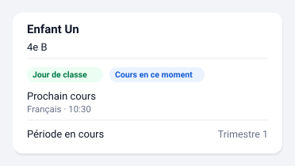

# Élève

En-tête de synthèse pour une vue par enfant : classe, état du jour et
prochain cours.



*Illustration synthétique : toutes les valeurs sont fictives.*

## Configuration

Un seul réglage obligatoire : l'appareil de l'enfant.

```yaml
type: custom:pronote-ng-eleve
device_id: <appareil de l'enfant>
```

## Options

| Option | Défaut | Effet |
| --- | --- | --- |
| `show_photo` | `false` | Affiche la photo de l'élève, **si l'établissement en publie une** (voir ci-dessous). L'entité correspondante n'est même pas résolue quand l'option est éteinte. |
| `show_establishment` | `false` | Ajoute le nom de l'établissement sous la classe. **Faux par défaut à dessein** : une carte est une surface partageable — capture d'écran, écran mural, partage de tableau de bord. |

### Exemple complet

Toutes les options renseignées, copiable tel quel :

```yaml
type: custom:pronote-ng-eleve
device_id: <appareil de l'enfant>
show_photo: true
show_establishment: false
```

`title` et `entities` fonctionnent en plus sur toutes les cartes : voir
[Deux options communes](../installation.md#deux-options-communes-a-toutes-les-cartes).

## Entités consommées

| Clé | Rôle |
| --- | --- |
| `sensor:class_name` | Requise. Son état est la classe ; son attribut `establishment` porte l'établissement. |
| `image:photo` | Optionnelle, et résolue uniquement si `show_photo` est vrai. Elle n'existe pas sur toutes les installations : voir « La photo » ci-dessous. |
| `binary_sensor:in_class` | Optionnelle. Un cours est en train de se dérouler. |
| `binary_sensor:school_day` | Optionnelle. Jour de classe. |
| `binary_sensor:holidays` | Optionnelle. Vacances. |
| `sensor:next_lesson` | Optionnelle. Matière et heure du prochain cours. |
| `sensor:current_period` | Optionnelle. Période en cours. |

Le nom affiché vient du **registre d'appareils** de Home Assistant, jamais
d'une chaîne écrite dans la carte : renommer l'appareil renomme la carte.

## La photo

`show_photo` peut rester sans effet, et ce n'est pas un défaut de la carte.
L'intégration ne crée l'entité `image` que pour un enfant dont le compte
PRONOTE annonce une photo. Beaucoup d'établissements n'en publient pas :
il n'y a alors aucune entité à résoudre, et la carte n'affiche **rien** —
pas de cadre vide, pas de message. Une information qu'on n'a pas n'est pas
une information.

Deux conséquences pratiques :

- Activer l'option sur une instance sans photo ne casse rien et n'affiche
  rien. Il n'y a pas de réglage à chercher : c'est l'établissement qui
  décide.
- Même quand la photo existe, elle peut ne jamais se charger, et la
  carte n'y est pour rien. L'intégration cherche l'image **une seule
  fois par rechargement** : `image.py` pose son drapeau de tentative
  *avant* l'appel et avale l'échec, si bien qu'une adresse injoignable
  laisse l'entité vide jusqu'au prochain rechargement de l'intégration —
  pas jusqu'à la prochaine collecte. Une seule tentative est délibéré :
  réessayer à chaque affichage dépenserait le budget quotidien sur une
  image inexistante, ce qui est la même règle qui interdit aux cartes de
  collecter à l'affichage. Seul un report du limiteur remet le drapeau à
  zéro, parce que reporté n'est pas échoué.
- **Il n'y a donc aucun réglage à chercher : c'est un rechargement de
  l'intégration, ou rien.** Et l'entité reste *disponible* dès que le
  compte annonce une photo, qu'elle finisse par en rendre une ou non —
  sinon la carte clignoterait.

## Si la carte est vide

Cette carte n'a pas d'état vide propre : sa seule entité requise est la
classe. Si elle manque, le socle affiche « entité introuvable » et nomme
la clé — le palier correspondant n'est pas activé dans les options de
l'intégration. Les lignes optionnelles absentes ne produisent aucun
message : une information qu'on n'a pas n'est pas une information.
