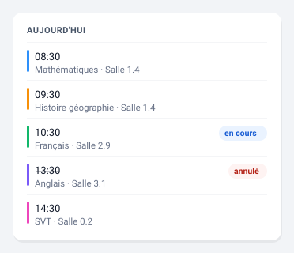

# Emploi du temps

Les cours du jour, du lendemain ou de la semaine, le créneau en cours
surligné.



*Illustration synthétique : toutes les valeurs sont fictives.*

## Configuration

```yaml
type: custom:pronote-ng-emploi-du-temps
device_id: <appareil de l'enfant>
range: today
show_rooms: true
```

## Options

| Option | Défaut | Effet |
| --- | --- | --- |
| `range` | `today` | `today`, `tomorrow` ou `week`. Change l'entité lue, pas seulement l'affichage. |
| `show_rooms` | `true` | Affiche la salle sous chaque cours. |
| `show_teachers` | `false` | Affiche le ou les professeurs. |
| `subject_colors` | — | Table matière → couleur. **En YAML uniquement**, voir plus bas. |

En mode `week`, un intertitre marque chaque jour. La hauteur annoncée à
Home Assistant suit le mode : une poignée de lignes en mode journée, trois
fois plus en mode semaine — sans quoi la répartition en colonnes se ferait
de travers.

### Exemple complet

Toutes les options renseignées, copiable tel quel :

```yaml
type: custom:pronote-ng-emploi-du-temps
device_id: <appareil de l'enfant>
range: week
show_rooms: true
show_teachers: true
```

`title` et `entities` fonctionnent en plus sur toutes les cartes : voir
[Deux options communes](../installation.md#deux-options-communes-a-toutes-les-cartes).

## Les couleurs de matière

Chaque ligne de les créneaux porte un **filet vertical** à sa gauche, dans la couleur de sa
matière. La couleur se prend à trois rangs, dans cet ordre :

1. **la couleur publiée par PRONOTE**, quand l'intégration l'expose ;
2. **sinon votre table `subject_colors`** ;
3. **sinon la gouttière reste réservée, mais transparente** — la ligne garde
   son alignement, elle n'a simplement pas de couleur.

!!! info "Aujourd'hui, seul le rang 2 donne des couleurs"

    L'intégration décode la couleur que votre établissement associe à chaque
    matière, mais ne la publie pas encore dans ses entités. Votre table est
    donc ce qui colore la carte pour l'instant. Le jour où l'intégration expose
    le champ, le rang 1 prend le dessus **sans que vous ayez rien à
    supprimer** : votre table reste le repli des matières que le serveur ne
    colore pas.

La table s'écrit **en YAML uniquement**, parce qu'aucun formulaire de Home
Assistant ne rend correctement un dictionnaire dont les clés sont les matières
de votre établissement :

```yaml
subject_colors:
  MATHEMATIQUES: '#1e88e5'
  histoire-geographie: '#43a047'
  anglais: '#fb8c00'
```

Les noms sont comparés **sans tenir compte de la casse, des espaces de bord ni
des accents** : `histoire-geographie` colore « Histoire-Géographie ». Vous
n'avez donc pas à recopier les libellés de PRONOTE à l'identique.

Deux règles encadrent ces couleurs, et elles ne changeront pas :

- **Un filet, jamais un aplat.** Une couleur derrière du texte casse le
  contraste dès qu'un thème sombre est actif, et votre thème n'y peut alors
  plus rien. En filet, le pire cas est un accent peu visible.
- **Seul l'hexadécimal strict est accepté** (`#1e88e5` ou `#f80`). Un nom de
  couleur CSS ou un `rgb()` est ignoré, et la ligne s'affiche sans couleur.
  Cette valeur finit dans une propriété de style : un filtre étroit est ce qui
  empêche une chaîne de configuration d'y injecter autre chose. La règle vaut
  aussi pour **votre** table — l'origine d'une valeur ne dit rien de son
  innocuité.

Le filet **ne porte aucune information à lui seul**. Il situe et il décore ;
le texte de la ligne informe. Une carte lue par quelqu'un qui ne distingue pas
ces teintes ne perd donc rien.

## Entités consommées

| Clé | Rôle |
| --- | --- |
| `sensor:lessons_today` | Requise en mode `today`. |
| `sensor:timetable_tomorrow` | Requise en mode `tomorrow`. |
| `sensor:timetable_week` | Requise en mode `week`. |
| `binary_sensor:in_class` | Optionnelle. **Droit de veto** sur le surlignage (voir ci-dessous). |
| `binary_sensor:test_today` | Optionnelle. Pastille de tête, en mode `today` uniquement. |
| `binary_sensor:outing_today` | Optionnelle. Idem. |

Chaque cours porte ses propres attributs `test` et `outing` : ce sont eux
qui situent l'information au bon créneau dans tous les modes. Les deux
pastilles de tête ne sont qu'un résumé du **jour**, et un résumé faux vaut
moins que pas de résumé — c'est pourquoi elles ne s'affichent pas en mode
`tomorrow` ni `week`.

## Qui décide du cours « en cours »

Deux sources pourraient répondre, et les faire concourir produirait tôt ou
tard deux réponses contradictoires. Elles ont donc des rôles distincts :

- les **horodatages** des créneaux désignent lequel ;
- `binary_sensor:in_class` a un **droit de veto**, jamais celui de désigner.

À `off`, aucun créneau n'est surligné même si l'horloge le suggère : le
capteur voit ce que l'attribut ne porte pas — jour banalisé, cours déplacé
après la collecte, élève dispensé. À `on` sans créneau correspondant, la
carte ne fabrique rien.

## Le code couleur des matières

PRONOTE laisse l'établissement choisir une couleur par matière, et l'élève
la connaît déjà de l'interface officielle. Les cartes la reprennent : une
**bordure colorée** à gauche de la ligne, de la couleur de la matière.

C'est la seule couleur que ces cartes n'inventent pas. Trois précisions,
parce qu'elle se comporte différemment de tout le reste.

**Une bordure, jamais un fond.** Les couleurs PRONOTE sont choisies pour le
fond blanc de son interface. Posées en aplat derrière du texte, elles
cassent le contraste dès qu'un thème sombre est actif, et le thème n'y peut
alors plus rien. En bordure, le pire cas est un accent peu visible : on perd
un rappel, jamais la lisibilité de la ligne.

**Rien à configurer, et rien à faire si votre établissement n'en met pas.**
Les lignes sans couleur gardent le même retrait que les autres — la
gouttière est réservée, simplement transparente. Une matière sans couleur ne
décale donc pas son voisinage.

**Les cartes concernées sont celles dont le producteur envoie une couleur** :
l'emploi du temps, les [devoirs](devoirs.md) et les moyennes par matière de
la carte [notes](notes.md). Les notes individuelles, les évaluations et le
bulletin n'en portent pas côté PRONOTE ; le prochain cours non plus, faute
d'être publié pour cette entité.

!!! info "Pas encore visible"

    L'intégration décode cette couleur mais ne la publie pas encore dans les
    attributs de ses entités. Les cartes la lisent déjà : l'accent
    apparaîtra dès qu'une version de l'intégration l'expose, sans aucune
    modification de votre tableau de bord. D'ici là, l'affichage est
    inchangé.

## Si la carte est vide

« Aucun cours » : week-end, jour férié, vacances. Ce n'est pas une panne
de collecte. Un cours **annulé** reste visible, barré : le retirer
donnerait l'illusion qu'il n'a jamais existé.
