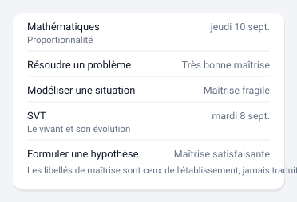

# Évaluations

Les évaluations par compétences, avec leur niveau de maîtrise.



*Illustration synthétique : rien n'y vient d'un élève réel. Les dates, les
horaires et les valeurs sont inventés ; les matières sont des matières de
programme et les libellés de maîtrise ceux du livret scolaire.*

## Configuration

Un seul réglage obligatoire : l'appareil de l'enfant.

```yaml
type: custom:pronote-ng-evaluations
device_id: <appareil de l'enfant>
```

## Options

| Option | Défaut | Effet |
| --- | --- | --- |
| `show_acquisitions` | `true` | Détaille chaque compétence sous son évaluation. À `false`, la carte se réduit à la liste des évaluations. |
| `limit` | `8` | Nombre d'évaluations affichées, la plus récente en tête. |

### Exemple complet

Toutes les options renseignées, copiable tel quel :

```yaml
type: custom:pronote-ng-evaluations
device_id: <appareil de l'enfant>
show_acquisitions: true
limit: 8
```

`title` et `entities` fonctionnent en plus sur toutes les cartes : voir
[Deux options communes](../installation.md#deux-options-communes-a-toutes-les-cartes).

## Entités consommées

| Clé | Rôle |
| --- | --- |
| `sensor:evaluations` | Requise. Son attribut `items` porte les évaluations et, pour chacune, ses compétences. |

Le libellé de maîtrise (« Très bonne maîtrise », « Maîtrise fragile »…)
est le texte écrit par l'établissement. Il n'est **jamais traduit** :
traduire inventerait une échelle qui n'est pas la sienne. Quand il
manque, la carte affiche l'abréviation à sa place, et rien si les deux
manquent.

## L'ordre et le plafond

Les évaluations sont triées sur l'**instant**, jamais sur le texte de la
date : deux horodatages à décalages horaires différents ne se comparent pas
correctement caractère à caractère. La plus récente est en tête. Une date
illisible ne s'intercale pas au hasard, elle part en fin de liste.

`limit` compte des **évaluations**, pas des lignes. Avec les compétences
détaillées, huit évaluations peuvent occuper trente lignes : c'est le
réglage à baisser si la carte devient trop haute, plus sûrement que
d'éteindre les compétences.

`show_acquisitions` change aussi la **hauteur annoncée** à Home Assistant —
huit unités avec le détail, quatre sans. Home Assistant s'en sert pour
répartir les cartes en colonnes : basculer l'option peut donc réorganiser
votre tableau de bord, et ce n'est pas un défaut d'affichage.

## Ce que la carte n'affiche pas

Une compétence publiée porte quatre champs : son intitulé, son niveau de
maîtrise, son abréviation et son **domaine**. La carte rend l'intitulé et le
niveau ; le domaine est publié et n'apparaît nulle part. L'évaluation
elle-même porte un identifiant, que la carte n'utilise pas non plus.

Une compétence qui n'a **ni** intitulé **ni** niveau est passée en silence :
une ligne vide sous une évaluation se lirait comme une compétence non
évaluée, ce qui serait une affirmation de plus que ce que la donnée permet.

L'intégration ne publie ni l'énoncé de l'évaluation, ni son enseignant, ni
le coefficient d'une compétence. Ces champs existent chez PRONOTE et
s'arrêtent avant les entités : aucune carte ne peut les montrer.

## Si la carte est vide

« Aucune évaluation » veut dire ce qu'il dit : la collecte fonctionne,
la période ne compte simplement aucune évaluation. C'est le cas normal
à la rentrée. Ce message est distinct de « pas encore collectée », qui
signale une entité présente au registre mais sans état exploitable.
