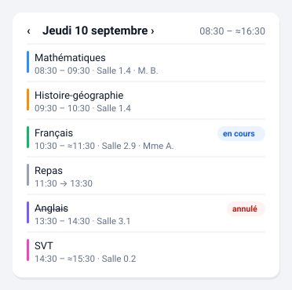

# Vue journée

La journée d'aujourd'hui en grille : la date et les bornes de la journée de
classe en en-tête, puis une colonne d'horaires, un filet de couleur par
matière, l'intitulé, la salle, le professeur, et les créneaux sans cours du
midi.

C'est un portage d'apparence de l'ancienne carte `lovelace-pronote`. Elle
ouvre sur **aujourd'hui**, et deux flèches parcourent les autres jours de la
semaine déjà collectée. Pour voir la semaine d'un seul tenant, voyez
[Emploi du temps](emploi-du-temps.md).



*Illustration synthétique : toutes les valeurs sont fictives.*

## Configuration

```yaml
type: custom:pronote-ng-journee
device_id: <appareil de l'enfant>
show_meal: true
show_rooms: true
show_teachers: true
show_nav: true
```

## Options

| Option | Défaut | Effet |
| --- | --- | --- |
| `show_meal` | `true` | Affiche la zone repas dans le creux du midi. |
| `meal_label` | « Repas » | Le mot affiché sur cette zone. |
| `meal_from` | `11:00` | Début de la plage du midi, en `HH:MM`. |
| `meal_to` | `14:30` | Fin de la plage du midi, en `HH:MM`. |
| `show_rooms` | `true` | Affiche la salle sous la matière. |
| `show_teachers` | `true` | Affiche le ou les professeurs. |
| `show_current` | `true` | Met en avant le cours en cours. |
| `show_header` | `true` | Affiche la date et les bornes de la journée. |
| `show_nav` | `true` | Affiche les flèches de navigation d'un jour à l'autre. |
| `subject_colors` | — | Table matière → couleur. **En YAML uniquement**, voir ci-dessous. |

Une plage du midi illisible (`meal_from: midi`) est **ignorée** : la plage
par défaut reprend, plutôt que de faire disparaître la zone repas sur une
faute de frappe.

**Les sept options à bascule figurent dans l'éditeur graphique** de la carte :
aucun YAML n'est nécessaire pour les régler. Seule la table de couleurs
demande le mode YAML, pour la raison expliquée plus bas.

## La navigation d'un jour à l'autre

```
‹  mercredi 9 septembre  ›                    08:00 – ≈14:30
```

Les flèches ne coûtent **aucune requête**, et c'est la seule raison pour
laquelle elles existent ici. PRONOTE facture son emploi du temps à la
**semaine** : demander « aujourd'hui » coûte exactement le même appel que
demander la semaine entière, et l'intégration a replié son palier hebdomadaire
dans le palier emploi du temps pour cette raison. Toute la semaine courante est
donc déjà dans un attribut, en mémoire de votre navigateur — changer de jour
n'est qu'un filtre sur une liste.

Une flèche ne déclenche donc jamais de collecte, et ne peut pas en déclencher :
une carte de ce dépôt n'a que deux appels de service à sa disposition et
celle-ci n'en utilise aucun. Votre budget de requêtes ne bouge pas, quel que
soit le nombre d'aller-retours.

### Ce que les flèches atteignent, et ce qu'elles n'atteignent pas

Elles s'arrêtent aux bornes de la **semaine collectée**, et ces bornes viennent
des données, non d'un calcul de calendrier. La différence compte un jour sur
sept : le lundi, la veille appartient à la semaine précédente, que personne n'a
collectée. La flèche est alors éteinte plutôt que de vous montrer un dimanche
dont la carte ne sait rien.

À l'intérieur de la fenêtre, en revanche, un jour **sans cours** reste
atteignable — et il le doit : « aucun cours mercredi » est l'information qu'on
venait souvent chercher. Le message n'est alors pas le même que pour
aujourd'hui, parce qu'« aucun cours aujourd'hui » posé au-dessus d'un mercredi
qu'on n'est pas serait tout simplement faux.

Au bord de la fenêtre, la flèche **saute au jour collecté le plus proche**
plutôt que d'avancer d'un jour civil dans le vide. Sans ce rattrapage, un
dimanche placé devant une semaine qui commence le mardi serait un cul-de-sac :
flèche éteinte alors que quatre jours sont en mémoire. Un lundi férié produit
exactement cette situation.

### Sans le palier hebdomadaire, pas de flèches

Si `sensor:timetable_week` n'existe pas chez vous — le palier peut être
désactivé — la carte est exactement ce qu'elle était : aujourd'hui, sans
flèches. Rien à configurer, rien à retirer.

### Le jour consulté n'est pas une option

Il n'y a **pas** d'option `day:`, et il n'y en aura pas. Un décalage écrit dans
le YAML d'un tableau de bord y resterait : la carte afficherait la veille pour
tous les habitants de la maison, en permanence, et l'avant-veille le lendemain.
La position est un état d'affichage — elle vit dans l'onglet, comme une
position de défilement, et un rechargement de page ramène sur aujourd'hui. Le
bouton « Aujourd'hui » apparaît dès qu'on n'y est plus.

## La salle et le professeur

Ils s'affichent sur une **deuxième ligne**, sous la matière, séparés d'un
point médian : « 2.14 · MARTIN P. ».

Cette deuxième ligne n'est pas cosmétique. Un nom de professeur fait
facilement trente caractères ; mis à la suite de la matière, il repoussait
les pastilles d'annulation hors du champ visible dès que la carte partageait
sa largeur avec une autre. Le point médian ne s'affiche que si les deux
éléments sont présents.

Chacun se coupe indépendamment (`show_rooms`, `show_teachers`). Les deux
coupés, la deuxième ligne disparaît entièrement plutôt que de laisser un
espace vide.

## L'en-tête : la date et les bornes de la journée

```
mercredi 9 septembre                    08:00 – 14:30
```

Les bornes viennent des attributs que l'intégration publie
(`first_start`, `last_end`) : la carte ne les recalcule pas. Deux précisions
qui viennent de la source de l'intégration :

- **elles comptent les cours annulés.** Un premier cours annulé fixe donc
  quand même le début de la journée — ce qui est le bon sens de « journée de
  classe » : l'élève est attendu à cette heure-là tant qu'on ne lui a pas dit
  le contraire.
- **la fin peut être une heure déduite**, parce qu'elle est la plus tardive
  des fins de cours et qu'une fin de cours peut l'être. L'attribut, lui, ne le
  dit pas : la carte va chercher le drapeau sur le créneau qui porte cette
  fin, et affiche `08:00 – ≈14:30` le cas échéant.

Sur une **journée vide**, l'en-tête reste et porte la date. C'est le moment où
il sert le plus : « aucun cours » tout seul laisse le doute sur le jour dont
on parle.

Si votre version de l'intégration ne publie pas ces attributs, la date
s'affiche et les bornes disparaissent — rien n'est inventé.

## Les couleurs de matière

Le filet vertical prend sa couleur à **trois rangs**, dans cet ordre :

1. **la couleur publiée par PRONOTE**, quand l'intégration l'expose ;
2. **sinon votre table `subject_colors`** ;
3. **sinon un accent neutre**, pris dans les couleurs de votre thème.

!!! info "Aujourd'hui, seul le rang 2 donne des couleurs"

    L'intégration décode la couleur que votre établissement associe à chaque
    matière, mais ne la publie pas encore dans ses entités. Votre table est
    donc ce qui colore la carte pour l'instant. Le jour où l'intégration
    expose le champ, le rang 1 prend le dessus **sans que vous ayez rien à
    supprimer** : votre table reste le repli des matières que le serveur ne
    colore pas.

La table se renseigne en YAML, parce qu'aucun formulaire de Home Assistant ne
rend correctement un dictionnaire dont les clés sont les matières de votre
établissement :

```yaml
type: custom:pronote-ng-journee
device_id: <appareil de l'enfant>
subject_colors:
  MATHEMATIQUES: '#1e88e5'
  histoire-geographie: '#43a047'
  Anglais: '#fb8c00'
```

Les noms sont comparés **sans tenir compte de la casse** ni des espaces de
bord : PRONOTE écrit souvent les matières en capitales, et vous n'avez pas à
les recopier à l'identique.

Deux règles encadrent ces couleurs, et elles ne changeront pas :

- **Un filet, jamais un aplat.** Une couleur derrière du texte casse le
  contraste dès qu'un thème sombre est actif, et votre thème n'y peut alors
  plus rien. En filet, le pire cas est un accent peu visible.
- **Seul l'hexadécimal strict est accepté** (`#1e88e5` ou `#f80`). Un nom de
  couleur CSS ou un `rgb()` est ignoré, et la ligne s'affiche sans couleur.
  Cette valeur finit dans une propriété de style : un filtre étroit est ce
  qui empêche une chaîne de configuration d'y injecter autre chose.

Le filet **ne porte aucune information à lui seul**. Il situe et il décore ;
les horaires, l'intitulé et les pastilles informent. Une carte lue par
quelqu'un qui ne distingue pas ces teintes ne perd donc rien.

## La zone repas

Elle apparaît sur un **creux sans cours** qui recouvre la plage du midi et
dure au moins une demi-heure. Un interclasse de dix minutes n'en déclenche
pas.

Ce qu'elle dit : **il n'y a pas cours ici.** Rien de plus. Ni qu'un menu est
servi, ni que votre enfant mange au réfectoire — la carte ne lit aucune
entité de cantine. Le mot « Repas » est une convention que vous assumez,
c'est pourquoi il est modifiable.

Pour le menu du jour, voyez la carte [Cantine](menu.md), qui lit les
entités faites pour ça.

### Exemple complet

Toutes les options renseignées, `subject_colors` compris — c'est la seule
option de la bibliothèque qui ne s'écrit qu'en YAML :

```yaml
type: custom:pronote-ng-journee
device_id: <appareil de l'enfant>
show_header: true
show_nav: true
show_current: true
show_rooms: true
show_teachers: true
show_meal: true
meal_label: Cantine
meal_from: "11:00"
meal_to: "14:30"
subject_colors:
  mathematiques: "#2e90fa"
  francais: "#12b76a"
  anglais: "#7a5af8"
```

**Les deux heures se citent entre guillemets.** Dans un tableau de bord en
mode YAML, `11:00` sans guillemets est lu comme un nombre — 660 — et la carte
n'accepte qu'une chaîne `HH:MM` : elle écarte alors la valeur et **retombe
silencieusement sur la fenêtre par défaut**, 11:00 → 14:30. Aucun message ne
le signale. Les guillemets sont inutiles depuis l'éditeur de Home Assistant,
et sans inconvénient dans les deux cas.

`title` et `entities` fonctionnent en plus sur toutes les cartes : voir
[Deux options communes](../installation.md#deux-options-communes-a-toutes-les-cartes).

## Entités consommées

| Clé | Rôle |
| --- | --- |
| `sensor:lessons_today` | Requise. Son attribut `lessons` porte toute la journée. |
| `sensor:timetable_week` | Optionnelle. La semaine collectée : c'est elle qui rend les flèches possibles. |
| `binary_sensor:in_class` | Optionnelle. **Droit de veto** sur la mise en avant. |

Les créneaux du capteur de semaine sortent de la **même** liste dédoublonnée
que ceux d'aujourd'hui, en amont côté intégration : les deux capteurs ne
peuvent pas se contredire sur un même jour. C'est pourquoi aujourd'hui se lit
toujours sur son propre capteur, avec ses bornes publiées, et les autres jours
sur la fenêtre.

Le capteur de cours en cours dit **si** un cours a lieu ; les horodatages
disent **lequel**. À `off`, aucun créneau n'est mis en avant même si
l'horloge le suggère : le capteur voit ce que l'attribut ne porte pas — jour
banalisé, cours déplacé après la collecte, élève dispensé.

## Le « ≈ » devant une heure de fin

PRONOTE n'envoie pas toujours l'heure de **fin** d'un cours. L'intégration la
calcule alors depuis la grille horaire de l'établissement, et ce calcul peut
se tromper. La carte le signale par un `≈`, dont le sens est donné en
infobulle.

Sur certains établissements ce marqueur est présent sur **chaque ligne** :
le serveur n'y publie aucune heure de fin. Ce n'est pas un défaut
d'affichage — c'est le cas de l'établissement sur lequel ces cartes sont
validées, où les 37 créneaux d'une semaine étaient tous dans ce cas.

Comme cette carte affiche l'heure de fin sur **toutes** ses lignes, c'est
elle qui rencontre le plus ce marqueur. Sans lui, sa colonne d'horaires
présenterait un calcul comme une donnée, toute la journée.

Le marqueur peut aussi apparaître sur la **zone repas** : le creux commence à
la fin du cours précédent, donc quand cette fin est déduite, la position du
repas l'est aussi.

Sur les jours **autres** qu'aujourd'hui, les bornes de l'en-tête sont
calculées par la carte, faute que l'intégration les publie pour ces jours-là.
Elle reprend la formule à l'identique — la première heure de début, la dernière
heure de fin, cours annulés compris — pour que l'en-tête veuille dire la même
chose d'un jour à l'autre. Le `≈` y suit le même drapeau.

## Si la carte est vide

« Aucun cours aujourd'hui » : week-end, jour férié, vacances. C'est un état
normal, distinct de « pas encore collectée ». Un cours **annulé** reste
visible, barré et marqué : le retirer donnerait l'illusion qu'il n'a jamais
existé.

Sur un autre jour, le message devient « Aucun cours ce jour-là » — la même
information, sans l'affirmation fausse. L'en-tête reste et porte la date : c'est
le moment où il sert le plus, « aucun cours » tout seul laissant le doute sur le
jour dont on parle.
