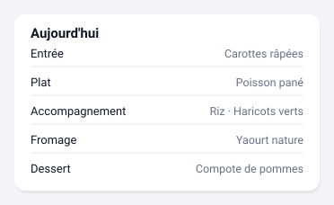

# Cantine

Le menu du jour ou du lendemain, service par service.



*Illustration synthétique : toutes les valeurs sont fictives.*

## Configuration

```yaml
type: custom:pronote-ng-menu
device_id: <appareil de l'enfant>
day: today
```

## Options

| Option | Défaut | Effet |
| --- | --- | --- |
| `day` | `today` | `today` ou `tomorrow`. Change l'entité lue. |

### Exemple complet

L'unique option de cette carte :

```yaml
type: custom:pronote-ng-menu
device_id: <appareil de l'enfant>
day: tomorrow
```

Pour afficher les deux jours, posez **deux** cartes : il n'y a pas d'option
qui les combine, chaque carte lit une entité et une seule.

`title` et `entities` fonctionnent en plus sur toutes les cartes : voir
[Deux options communes](../installation.md#deux-options-communes-a-toutes-les-cartes).

## Entités consommées

| Clé | Rôle |
| --- | --- |
| `sensor:menu_today` | Requise avec `day: today`. |
| `sensor:menu_tomorrow` | Requise avec `day: tomorrow`. |

Un menu n'est pas une liste plate : il a des services. Les attributs sont
donc sept listes — entrée, plat, accompagnement, fromage, dessert, autre —
plus un booléen `is_lunch`, et non un `items[]`. La carte affiche une ligne
par service non vide, et tolère les trois formes rencontrées dans la
nature : une chaîne, un tableau de chaînes, un tableau d'objets nommés.

## La seule carte pilotée par ses attributs

L'intégration laisse délibérément l'**état** de ces capteurs à
« inconnu », même quand la collecte a réussi : un nombre de plats à zéro
affirmerait qu'un menu existe. Le socle écarterait donc normalement la
carte avec un « pas encore collectée ».

Cette carte porte pour cette raison le seul `attributeDriven` du projet :
le socle lui rend la main, et elle assume les **deux** phrases, parce
qu'elle est la seule à pouvoir les distinguer.

## Si la carte est vide

| Ce que la carte dit | Ce que ça veut dire |
| --- | --- |
| « Pas de menu publié pour ce jour » | La collecte a réussi. L'établissement ne publie rien ce jour-là — mercredi après-midi, vacances, ou cantine sans service. |
| « Donnée pas encore collectée » | Rien n'est encore arrivé : ni l'indicateur de publication, ni aucun des sept services. |

La distinction repose sur l'attribut `published`. Sur une intégration
antérieure à celui-ci, la carte se rabat sur la présence des sept clés.
