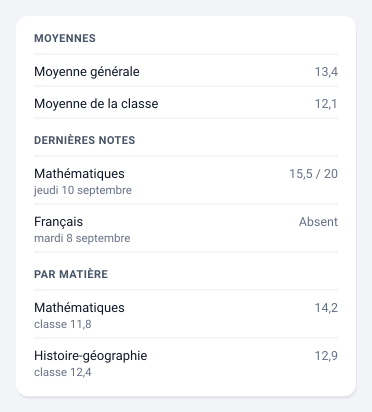

# Notes

Moyenne générale, dernières notes, moyennes par matière et bulletin.



*Illustration synthétique : rien n'y vient d'un élève réel. Les dates, les
horaires et les valeurs sont inventés ; les matières sont des matières de
programme.*

## Configuration

```yaml
type: custom:pronote-ng-notes
device_id: <appareil de l'enfant>
sections:
  - average
  - latest
  - subjects
```

## Options

| Option | Défaut | Effet |
| --- | --- | --- |
| `sections` | `average`, `latest`, `subjects` | Blocs affichés, dans cet ordre : `average` (moyenne de l'élève et de la classe), `latest` (dernières notes), `subjects` (moyennes par matière), `report_card` (bulletin). |
| `limit` | `8` | Nombre de dernières notes affichées. |
| `subject_colors` | — | Table matière → couleur. **En YAML uniquement**, voir plus bas. |

`report_card` n'est **pas** dans les valeurs par défaut : le bulletin
n'existe qu'en fin de période, et une section vide la plupart de l'année
n'aide personne.

### Exemple complet

Toutes les options renseignées, les quatre sections comprises :

```yaml
type: custom:pronote-ng-notes
device_id: <appareil de l'enfant>
sections:
  - average
  - latest
  - subjects
  - report_card
limit: 10
```

L'ordre des sections dans le YAML ne change pas l'ordre d'affichage : la
carte les rend toujours dans le même ordre, `sections` ne fait que choisir
lesquelles paraissent.

`title` et `entities` fonctionnent en plus sur toutes les cartes : voir
[Deux options communes](../installation.md#deux-options-communes-a-toutes-les-cartes).

## Les couleurs de matière

Chaque moyenne par matière porte un filet vertical à gauche, dans la
couleur de sa matière.

Depuis la version 0.0.13 de l'intégration, cette couleur vient
**du serveur** : vous n'avez rien à écrire pour la voir. Une table
`subject_colors` ne sert plus qu'à colorer une matière que votre
établissement laisse sans couleur, ou à remplacer une teinte qui vous
déplaît — et le serveur **gagne** sur votre table, donc une entrée qui
double une couleur reçue ne fait plus rien.

Les **notes individuelles** n'en portent pas : PRONOTE colore la matière,
pas la note. Le filet d'une moyenne se lit donc comme celui d'un créneau
d'emploi du temps, et une note reste sans accent — ce n'est pas un défaut
de collecte.

```yaml
type: custom:pronote-ng-notes
device_id: <appareil de l'enfant>
subject_colors:
  MATHEMATIQUES: '#1e88e5'
  histoire-géographie: '#8d6e63'
  Sciences: '#43a047'
```

Les trois rangs de la couleur, le format accepté — hexadécimal strict,
le reste est refusé sans un mot — le repliement de la casse et des
accents, et ce que l'option ne fait pas sont décrits une fois pour
toutes dans [Les couleurs de matière](../couleurs-de-matiere.md).

## Entités consommées

| Clé | Rôle |
| --- | --- |
| `sensor:overall_average` | Au moins une des trois. Moyenne générale ; son attribut `out_of` porte le barème. |
| `sensor:grades` | Au moins une des trois. `items[]` porte chaque note. |
| `sensor:averages` | Au moins une des trois. `items[]` porte les moyennes par matière. |
| `sensor:class_average` | Optionnelle. Moyenne de la classe. |
| `sensor:latest_grade` | Optionnelle, et lue seulement pour son **motif** (voir ci-dessous). |
| `sensor:current_period` | Optionnelle. Ligne transverse, hors des sections. |
| `sensor:report_card` | Optionnelle. `subjects[]` et l'appréciation générale. |

La carte s'affiche dès qu'**une** des trois premières est résolue. C'est ce
qui permet à un parent dont l'intégration ne publie qu'un palier d'obtenir
quelque chose d'utile.

## Les notes sans valeur numérique

PRONOTE emploie des sentinelles — « Absent », « Non noté », « Dispensé » —
qui rendent l'état non numérique. Le motif vit alors dans l'attribut
`status`, et c'est lui qui est montré : jamais un vide, jamais un zéro.

## Aucun sélecteur de période

L'intégration crée une entité par période close, toutes avec le même nom
de traduction sur le même appareil. La résolution rend la première
correspondance et rien ne permet de distinguer les autres — un sélecteur
afficherait donc une période qu'il ne maîtrise pas. La période **en cours**
s'affiche en revanche comme une ligne transverse, dès qu'elle est
exploitable.

## Le code couleur des matières

Les **moyennes par matière** portent la couleur que l'établissement associe
à la matière, en bordure gauche — le même code visuel que sur l'emploi du
temps, dont la page explique [comment il fonctionne et pourquoi il n'est pas
encore visible](emploi-du-temps.md#le-code-couleur-des-matieres).

C'est la seule section colorée de cette carte : PRONOTE n'envoie pas de
couleur pour une note individuelle ni pour une matière de bulletin. Les
autres lignes gardent malgré tout le même retrait, pour que la liste des
notes et celle des moyennes — qui se suivent sans intertitre — restent
alignées.

## Si la carte est vide

« Aucune note pour cette période » : c'est le cas normal à la rentrée, et
il est distinct de « pas encore collectée ». Les moyennes par matière ont
leur propre phrase, parce qu'un relevé peut porter des notes sans qu'aucune
moyenne ne soit encore publiée.
