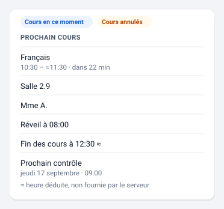

# Prochain cours

Le prochain cours à venir : matière, plage horaire, salle et professeur.



*Illustration synthétique : toutes les valeurs sont fictives.*

## Configuration

```yaml
type: custom:pronote-ng-prochain-cours
device_id: <appareil de l'enfant>
```

## Options

| Option | Défaut | Effet |
| --- | --- | --- |
| `show_wake_up` | `false` | Ajoute l'heure de réveil calculée par l'intégration. |
| `show_end_of_day` | `false` | Ajoute l'heure de fin des cours. |
| `show_next_test` | `false` | Ajoute le prochain contrôle, avec son jour et son heure. |

Les trois entités correspondantes ne sont **résolues que si leur option est
active** : une option éteinte ne coûte aucun balayage de registre.

### Exemple complet

Toutes les options renseignées, copiable tel quel :

```yaml
type: custom:pronote-ng-prochain-cours
device_id: <appareil de l'enfant>
show_wake_up: true
show_end_of_day: true
show_next_test: true
```

`title` et `entities` fonctionnent en plus sur toutes les cartes : voir
[Deux options communes](../installation.md#deux-options-communes-a-toutes-les-cartes).

## Entités consommées

| Clé | Rôle |
| --- | --- |
| `sensor:next_lesson` | Requise. Son état est l'horodatage de début ; ses attributs portent matière, salle, professeurs, fin et annulation. |
| `sensor:next_wake_up` | Optionnelle, sous `show_wake_up`. |
| `sensor:end_of_lessons` | Optionnelle, sous `show_end_of_day`. |
| `sensor:next_test` | Optionnelle, sous `show_next_test`. |
| `binary_sensor:in_class` | Optionnelle. Pose la mention « Cours en ce moment ». |
| `binary_sensor:lessons_canceled` | Optionnelle. Signale des annulations dans la journée. |

## Ce que la carte ne prétend pas savoir

Quand `binary_sensor:in_class` est à `on`, un intitulé « Prochain cours »
sépare la mention du cours affiché : la pastille décrit **maintenant**, la
ligne décrit **la suite**. Sans cet intitulé, on lisait l'une pour l'autre.

Une heure de fin peut être **déduite** plutôt que fournie. Elle porte alors
un `≈`, dont le sens est donné en infobulle.

Le marqueur a **une seule** cause : PRONOTE n'a pas envoyé la fin du
créneau, et elle est calculée depuis la position du cours dans la grille
horaire de l'établissement. Ce calcul peut se tromper — c'est pourquoi la
carte le signale au lieu de présenter l'heure comme une donnée.

Sur certains établissements le marqueur est allumé sur **chaque** ligne :
le serveur n'y publie aucune heure de fin. Ce n'est pas un défaut
d'affichage, et c'est le cas de l'instance sur laquelle ces cartes sont
validées.

L'absence du marqueur n'est pas pour autant une garantie. L'intégration
remplace aussi une fin **impossible** — à l'heure de début ou avant — par
un créneau d'une heure, et ce remplacement-là ne lève pas le drapeau : si
un serveur envoyait une fin inversée, l'heure affichée serait fabriquée
sans le `≈`. Aucun créneau de ce genre n'a été observé.

## Si la carte est vide

« Aucun cours à venir » : la journée est terminée, ou la semaine. C'est un
état normal, distinct de « pas encore collectée ». La carte le décide
elle-même, parce que l'intégration publie ici un état que le socle ne peut
pas interpréter à sa place.

Un état illisible n'efface pas la carte : matière, salle et professeur
restent affichés s'ils sont exploitables.
