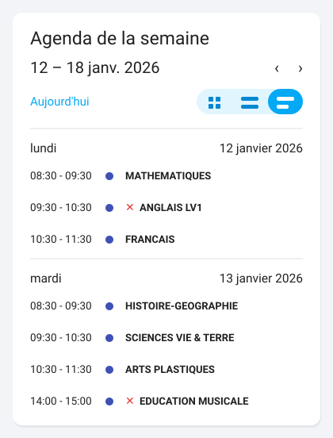
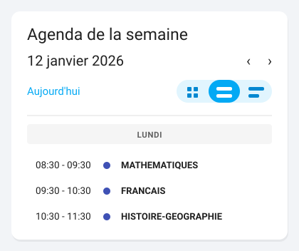
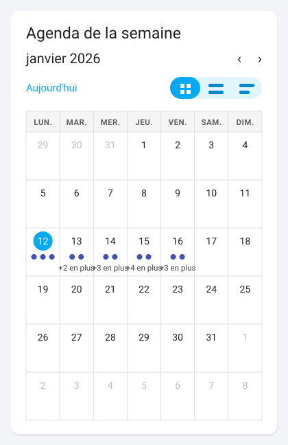

# L'agenda natif de Home Assistant

L'intégration publie **trois entités `calendar`** — l'emploi du temps, les
devoirs et les punitions. La carte **Agenda** livrée avec Home Assistant les
affiche telles quelles : il n'y a rien à installer, et pour voir une semaine
d'un coup d'œil c'est le meilleur outil disponible, y compris comparé aux
cartes de ce dépôt.

Cette page explique comment la configurer, ce que chaque agenda contient, et la
seule chose qui surprend : **jusqu'où il sait**.

## La configuration la plus utile

```yaml
type: calendar
entities:
  - calendar.enfant_un_emploi_du_temps
initial_view: listWeek
title: Agenda de la semaine
grid_options:
  columns: full
  rows: 9
```



*Illustration synthétique : toutes les valeurs sont fictives.* Le rendu est
celui du YAML ci-dessus. Les deux cours préfixés de ❌ sont annulés : l'agenda
les garde à leur place au lieu de les effacer.

Remplacez `enfant_un` par ce qui figure dans **vos** identifiants d'entité :
ils sont dérivés du nom de l'appareil de l'enfant, donc propres à votre
installation. Le sélecteur d'entités de l'éditeur les propose.

| Option | Ce qu'elle fait |
| --- | --- |
| `initial_view` | La vue à l'ouverture : `listWeek` (la semaine en liste), `dayGridMonth` (le mois en grille), `dayGridDay` (la journée). |
| `title` | L'intitulé de la carte. Sans lui, la carte n'en affiche aucun. |
| `grid_options` | La place prise dans une vue en **sections**. `columns: full` occupe toute la largeur, `rows` fixe la hauteur. |

**`listWeek` est le bon choix par défaut**, et pas seulement sur téléphone : une
journée de cours tient en cinq à huit lignes, là où la grille mensuelle affiche
des cases minuscules. La grille redevient intéressante pour les devoirs, qui
sont des journées entières.

Les **trois boutons en haut à droite** changent de vue sans toucher à la
configuration : `initial_view` ne fixe que celle de l'ouverture. En
`dayGridDay`, la même carte se réduit à la journée du jour — utile en colonne
étroite, à côté d'autres cartes :



*Illustration synthétique : toutes les valeurs sont fictives.*

`grid_options` n'existe que dans les vues en **sections**, la disposition par
défaut des tableaux de bord récents. Dans une vue en masonry (l'ancienne),
retirez ce bloc : il serait ignoré.

## Les trois agendas ensemble

```yaml
type: calendar
entities:
  - calendar.enfant_un_emploi_du_temps
  - calendar.enfant_un_devoirs
  - calendar.enfant_un_punitions
initial_view: listWeek
title: Semaine scolaire
```

Home Assistant attribue une couleur par entité et l'affiche en légende. C'est le
moyen le plus court d'avoir cours, devoirs et retenues au même endroit — et la
seule façon de voir qu'un devoir tombe le jour d'une retenue.

## Ce que chaque agenda contient

| Entité | Un événement, c'est… | Résumé | Description | Lieu |
| --- | --- | --- | --- | --- |
| `calendar.<enfant>_emploi_du_temps` | un cours | la matière | le statut, les professeurs, le mémo | la salle |
| `calendar.<enfant>_devoirs` | une échéance, sur la journée entière | la matière | l'énoncé | — |
| `calendar.<enfant>_punitions` | **un créneau** de retenue | la nature de la punition | les motifs, qui l'a donnée, le travail à faire | — |

Trois précisions qui changent la lecture.

**Un cours annulé reste affiché**, préfixé de ❌. Le retirer donnerait
l'illusion qu'il n'a jamais existé, alors que c'est justement ce qu'un parent
regarde le jeudi matin. Le motif, quand PRONOTE en donne un, est dans la
description.

**Un devoir fait est préfixé de ✅.** Les devoirs sont des événements de
**journée entière** parce que PRONOTE donne une date d'échéance et pas une
heure : inventer 8 h ou 18 h serait une affirmation de plus que la donnée.

**Une punition de trois séances fait trois événements**, un par créneau. C'est
volontaire : trois séances sont trois rendez-vous auxquels il faut conduire
l'enfant, et un événement unique qui les couvrirait serait faux dans les deux
sens — trop long, et muet sur les horaires réels.

## Jusqu'où l'agenda sait

**C'est le point à connaître avant de configurer une vue mensuelle.** Ces
agendas ne vont **jamais** chercher de données quand vous faites défiler : ils
filtrent ce qui est déjà en mémoire.

Ce n'est pas une limite technique, c'est une protection. PRONOTE facture son
emploi du temps **à la semaine**, et sanctionne une adresse IP qui l'interroge
trop. Une carte qu'on fait défiler de trois mois vers l'avant placerait trois
mois de requêtes, en une seconde, sans que personne ne l'ait demandé.

| Agenda | Ce qu'il contient |
| --- | --- |
| Emploi du temps | la **semaine PRONOTE en cours**, jours déjà passés compris, plus la suivante le dernier jour de la semaine |
| Devoirs | l'**horizon des devoirs**, 14 jours par défaut, réglable dans les options de l'intégration |
| Punitions | les créneaux de la **période en cours** |

Cela se voit immédiatement en vue mensuelle :



*Illustration synthétique : toutes les valeurs sont fictives.*

Les pastilles s'arrêtent au vendredi de la semaine en cours, et le « +4 en plus »
dit qu'une journée ne tient pas dans une case. Le reste du mois n'est pas vide
parce qu'il n'y a pas cours : il est vide parce que rien n'a été collecté, et
que faire défiler n'ira rien chercher.

Donc `dayGridMonth` affiche une semaine remplie dans un mois vide, et c'est
normal. Si vous voulez la vue mensuelle malgré tout, elle est utile pour les
**devoirs** — leur horizon couvre deux semaines — et trompeuse pour l'emploi du
temps.

Un dernier détail rassurant : chaque événement porte l'identifiant que PRONOTE
lui donne. Une carte qui relit une plage déjà affichée reconnaît le même
événement au lieu de le dupliquer, et un cours remplacé n'apparaît pas deux fois
à côté de celui qui l'a remplacé.

## Deux tableaux de bord complets

### La semaine, en pleine largeur

```yaml
type: sections
sections:
  - type: grid
    cards:
      - type: heading
        heading: Enfant Un
      - type: tile
        entity: sensor.enfant_un_prochain_cours
        grid_options:
          columns: 6
      - type: tile
        entity: sensor.enfant_un_devoirs_a_faire
        grid_options:
          columns: 6
      - type: calendar
        entities:
          - calendar.enfant_un_emploi_du_temps
          - calendar.enfant_un_devoirs
        initial_view: listWeek
        title: Agenda de la semaine
        grid_options:
          columns: full
          rows: 9
```

### Le mois des devoirs, à côté de la journée

```yaml
type: sections
sections:
  - type: grid
    cards:
      - type: calendar
        entities:
          - calendar.enfant_un_emploi_du_temps
        initial_view: dayGridDay
        title: Aujourd'hui
      - type: calendar
        entities:
          - calendar.enfant_un_devoirs
        initial_view: dayGridMonth
        title: Devoirs à venir
```

La vue du jour à gauche, l'horizon des devoirs à droite : chaque agenda dans la
vue qui correspond à ce qu'il sait.

## Ce que l'agenda natif ne peut pas montrer

Il affiche fidèlement ce qu'on lui donne, et c'est sa qualité. Mais il ne sait
rien de ce que les données **taisent** :

- **une heure de fin déduite** plutôt que fournie par l'établissement s'affiche
  comme une heure normale. Les cartes de ce dépôt la marquent d'un `≈` ;
- **un devoir en retard** n'est pas distingué d'un devoir à venir ;
- **une couleur de matière** n'existe pas : la couleur d'un événement est celle
  de son agenda, pas de sa matière.

C'est la raison d'être des cartes de ce dépôt, et la seule. Voir
[Vue journée](cartes/journee.md) pour l'équivalent coloré d'une journée, et
[Ce que ces cartes ne feront jamais](limites.md) pour ce qui reste hors de
portée des deux.

Le tour complet des cartes natives — quelle carte pour quelle donnée, au-delà
de l'agenda — est dans
[Afficher les données](https://fiveelements.github.io/ha-pronote-ng/AFFICHER-LES-DONNEES/),
côté intégration.
