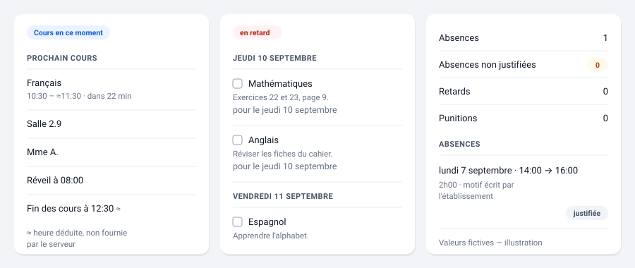

# Pronote NG — Cartes

Une bibliothèque de dix cartes Lovelace pour afficher, dans un
tableau de bord Home Assistant, les données scolaires collectées par
l'intégration [Pronote NG](https://github.com/FiveElements/ha-pronote-ng) :
emploi du temps, devoirs, notes, cantine, vie scolaire.

Chaque carte se configure avec un seul réglage : l'appareil de
l'enfant. Aucune ne demande d'identifiant d'entité — voir
[Installation](installation.md) pour comprendre pourquoi.

*Illustration synthétique — aucune donnée réelle n'entre dans ce dépôt.*

## Les dix cartes

| Carte | À quoi elle sert |
| --- | --- |
| [Élève](cartes/eleve.md) | En-tête de synthèse : photo, classe, état du jour, prochain cours |
| [Prochain cours](cartes/prochain-cours.md) | Le prochain cours à venir : matière, heure, salle, professeur |
| [Vue journée](cartes/journee.md) | La journée en grille : horaires, couleur de matière, annulations et repas |
| [Emploi du temps](cartes/emploi-du-temps.md) | Les cours du jour, du lendemain ou de la semaine |
| [Devoirs](cartes/devoirs.md) | Les devoirs à faire, avec échéance et matière |
| [Notes](cartes/notes.md) | Moyennes, dernières notes et moyennes par matière |
| [Évaluations](cartes/evaluations.md) | Les évaluations par compétences, avec leur niveau de maîtrise |
| [Cantine](cartes/menu.md) | Le menu du jour ou du lendemain, plat par plat |
| [Vie scolaire](cartes/vie-scolaire.md) | Absences, retards et punitions |
| [Limiteur](cartes/limiteur.md) | Budget d'appels, état du limiteur, bouton de rafraîchissement |

## Pour commencer

Voir [Installation](installation.md) : installation par HACS, ajout
d'une carte, et les deux points qui surprennent le plus souvent
(configuration par appareil, absence d'identifiant d'entité).

Puis [Assembler un tableau de bord](tableaux-de-bord.md) : dans quel
ordre disposer les cartes, quelle largeur donner à l'emploi du temps de
la semaine, comment s'organiser avec plusieurs enfants, et pourquoi la
carte limiteur ne se met qu'une fois.

Et si les matières s'affichent toutes en gris :
[Les couleurs de matière](couleurs-de-matiere.md) explique pourquoi rien
n'est coloré tant que vous n'avez pas écrit de table, et comment
l'écrire.

## Ce que ces cartes ne feront jamais

Certaines données ne deviennent volontairement jamais des entités —
l'URL iCal, le bloc d'identité, le PDF d'emploi du temps. Voir
[Ce que ces cartes ne feront jamais](limites.md).

## Licence

Ce projet est distribué sous licence MIT.
